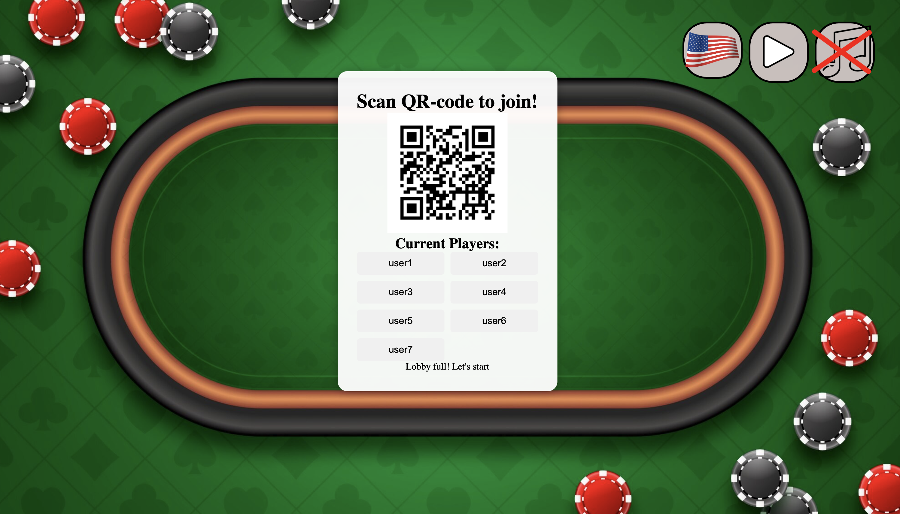
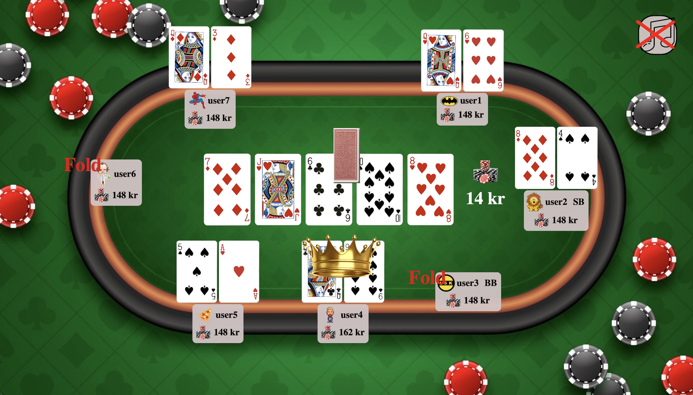

# kahoot_style_poker

## Table of contents

1. [How to start a game](#How-to-start-a-game)
2. [Player guide](#Player-guide)
3. [Nice to know](#Nice-to-know)
4. [Technical Overview](#Technical-overview)

## How to initiate a game

1. Dowload the repo, and navigate into the folder.

- git clone _repo-url_
- _cd kahoot_style_poker_

2. First, you need to enter your IP address in the following files (right below "useEffect(() => {")):

- "kahoot_style_poker/src/pages/HostPlaying"
- "kahoot_style_poker/src/pages/HostWaiting"
- "kahoot_style_poker/src/pages/PlayerLogin"
- "kahoot_style_poker/src/pages/PlayerPlaying"

The IP address can be found using:

- ifconfig | grep inet on macOS/Linux
- ipconfig | grep inet on Windows

3. Now you can navigate back to the root folder, and run:

- chmod +x ./init.sh

This will give your computer permission to read the file

- ./init.sh

This will run the setup file. It will install necesseary packages and libraries, generate a new qr-code and lastly start a new game server.

4. The host view will show a QR code. Players on the same network can scan this to join the game. Once 2 to 7 players have joined, the host can press the Play button in the top right to begin the game.

   

5. Use the flag button to toggle between Norwegian and English. Use the music note to play or pause background music.

6. The game continues until only one player remains with chips. Players take turns and compete in classic Texas Hold'em format.

   
   

## Player guide

1.  Scan the QR code from your phone to access the login page.

2.  Enter a username and press the Join button.

    

3.  Choose an avatar to appear next to your name (purely cosmetic).

    

4.  Change between english and norwegian by pressing the image of the flag in the left corner. This will only affect your device.

5.  When the host starts the game, you will gain two personal cards that only you can see on your phone. When it is your turn, you will see the buttons "call", "raise" and "fold". When it is not your turn, an "add-on" button (or buyin if you have zero chips) and a "leave game" button will appear. The buy in/add on only appears if you have below 150 kr and will give you 150 kr for the next round. The leave button is for leaving the game. NB! After clicking "leave game" you have to stay on the webpage for the whole round before closing your browser. Otherwise, the game will not move further to the next round.

    
    

    

6.  Click "Hand ranking" to see what combination of cards are best to have. Remember: The better combination - the lower the probability is for someone to have it.

    

7.  After each round you will have the opportunity to show one of the cards or both. After every player has chosen how many cards they want to show, the winner(s) of the round will be declared and their chips will increase with the pot size.

    

## Nice to know

- If you want a higher or lower buy in, you can adjust the amount in kahoot_style_poker/server/index.ts line 79. The player instances can take another parameter of starting chips. If none is given, 150 is the defualt amount.

- Standard Texas Holem rules can be found here: [Poker rules](https://www.pokernews.com/poker-rules/texas-holdem.htm)

- If the size of the qr-code or the players are too small or big, you can simply enlarge it by clicking cmd+/- or ctr+/-. The players placement is set absolute, which means that variations in srcreen size can affect their actual placement.

- The game is meant to be played with a phone. If you choose to use your computer, it is recommended to use chrome as a browser and change the display to a phone via "inspect element" in the toolbar.

- For the prize of the round to be correctly calculated, the winner must show both cards! In other words: If you are first to show your cards, you must do so. Then, later players can choose not to show both cards if they are certain they are beaten. If everyone else already has folded, it is OK to only show one card.

## Technical overview

This project is a real-time, multiplayer poker game build using Node.js, WebSockets and a React-based frontend. It supports synchronous gameplay with a host view and multiple players. The game uses a server-client architecture where the server manages the entire game logic and communicates with players and the host through WebSockets over HTTP. All game events are communicated in real-time using WebSocket messages. When a player acts the client sends a message to the server. Then, the server updates the game state and broadcasts relevant updates to all connected clients. Turn handling is an important part of the program to make it as similar to a normal poker game as possible. The player who has action receives a "yourTurn" message from the server. When the player receives this message, the buttons "call", "raise" and "fold" will appear in their UI displays. All other players are blocked from acting until it is their turn.

### Description of each folder

#### public/

Contains static files that are served as-is. These include:

- Player and host avatars
- Playing card images
- QR code image
  Used for global/static assets not tied to specific components.

#### server/

Contains the main server code which handles:

- WebSocket setup
- Game state management
- Round and betting logic
- Message handling between clients and server

This is where the core logic of the programme is.

#### src/assets/

Holds component-specific images, such as UI icons or decorations that are only used within certain React components.

#### Components/

Reusable React components that make up the user interface. These are modular UI elements used across pages (e.g., player seats, action buttons, card displays).

#### src/context/

Contains React Contexts to store shared app-wide settings:

- MusicContext: Retains music on/off state as users navigate between pages.
- LanguageContext: Maintains language selection across pages like /PlayerLogin and /PlayerPlaying.
  This ensures a consistent user experience.

#### src/gameLogic/

Contains core game classes and mechanics:

- **Card:** Represents a playing card with suit and rank.
- **Deck:** Manages a 52-card deck, handles shuffling and dealing logic.
- **Player:** Tracks all player-specific properties (chips, hand, actions, avatar).
- **Game:** Contains the rules and flow of a round, including betting, phases, and payouts.
- **HandEvaluator:** Evaluates hands and ranks players to determine winner(s).

#### Other/

Contains a TypeScript file to generate a QR-code to join the game.

#### Pages

Renders the actual frontend routes. Each page combines components, logic, and JSX (JavaScript XML) to form a complete UI screen:

- /PlayerLogin
- /PlayerPlaying
- /HostWaiting
- /HostPlaying
