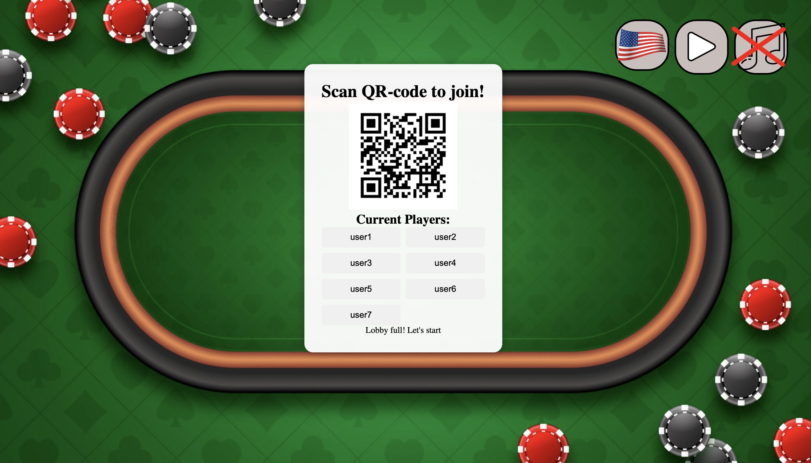
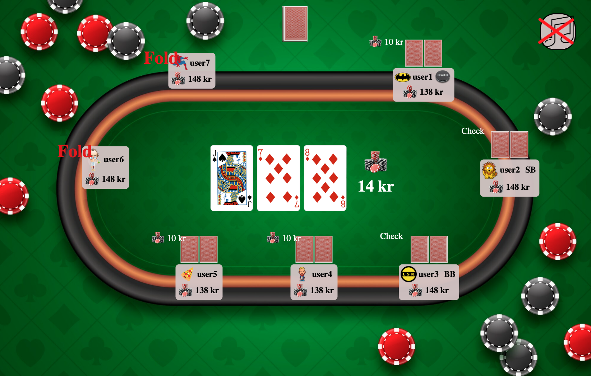
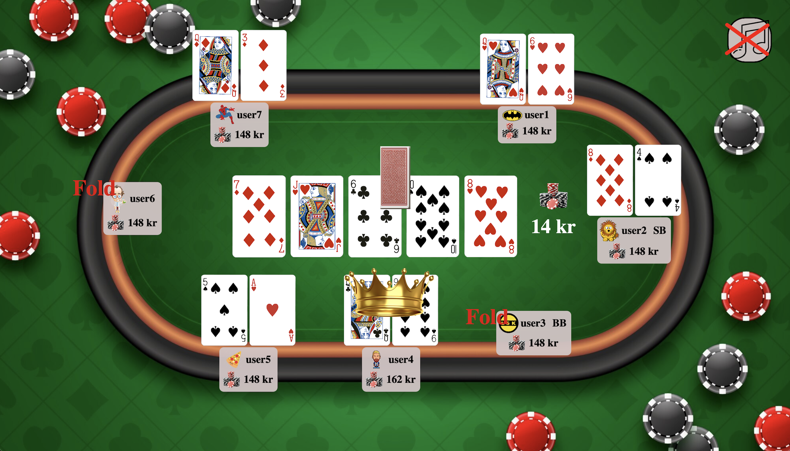
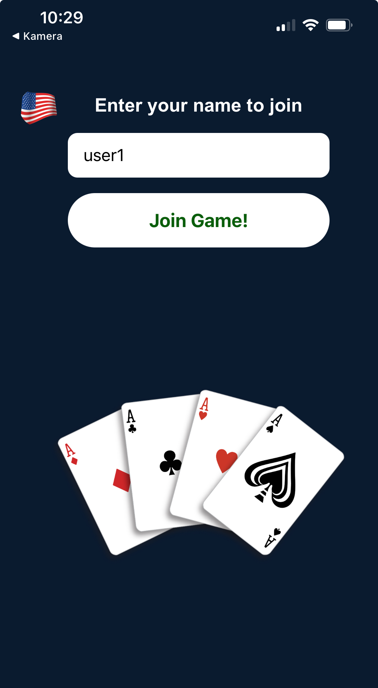
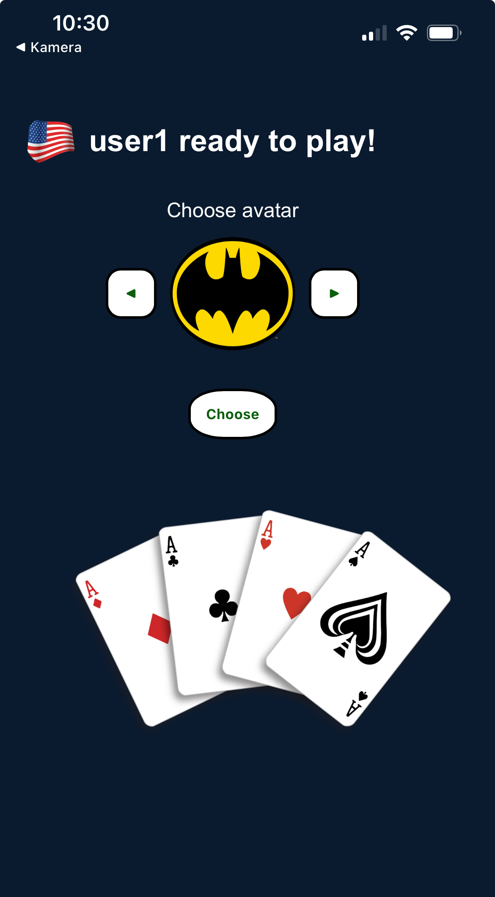
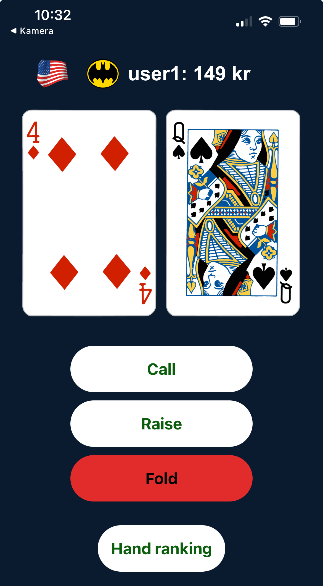
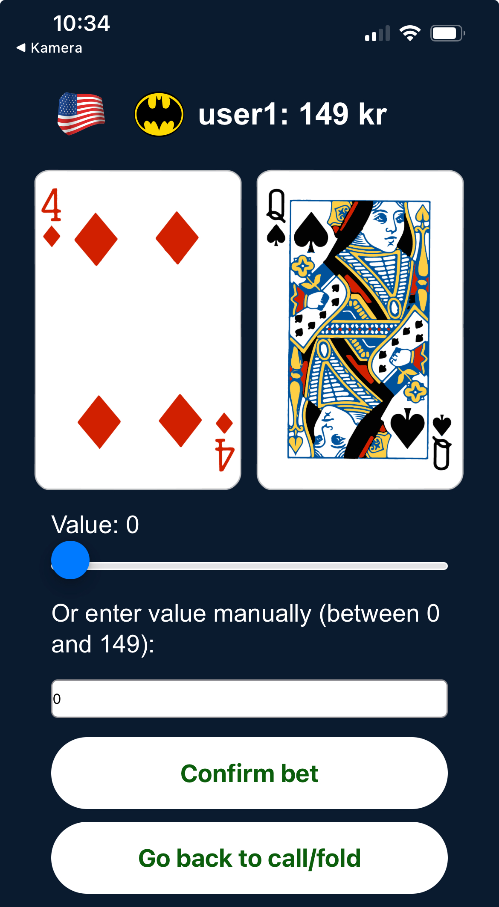
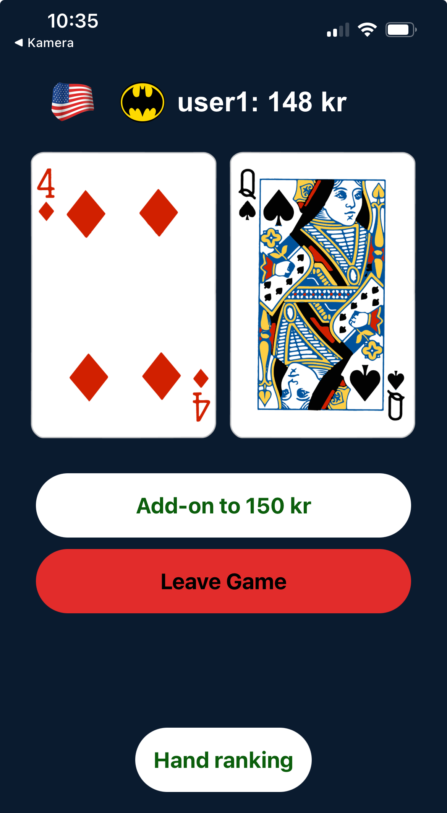
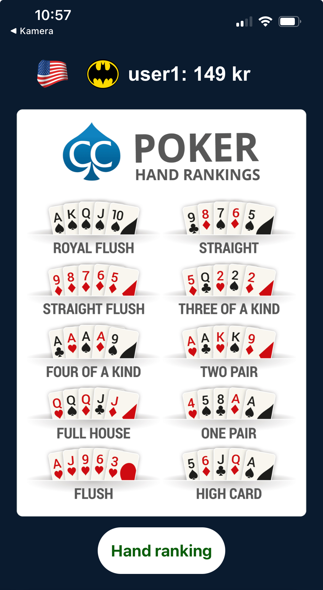

# kahoot_style_poker

## Table of contents

1. [How to start a game](#How-to-start-a-game)
2. [Player guide](#Player-guide)
3. [Nice to know](#Nice-to-know)
4. [Technical Overview](#Technical-overview)

## How to start a game

1. Use your favorite browser to check out this link: https://pokergame-beta.vercel.app

This will take you to a welcome page where you can either create a new game or join an existing game.

2. When you host a game, QR code and a game code will be shown on the screen. The players can either scan the QR code to join, or navigate to the welcome page and type in the code. Once 2 to 7 players have joined, the host can press the Play button in the top right to begin the game.

   

3. Use the flag button to toggle between Norwegian and English. Use the music note to play or pause background music.

4. The game continues until only one player remains with chips. Players take turns and compete in classic Texas Hold'em format.

   
   

## Player guide

1.  Scan the QR code from your phone to access the login page, or use the welcome page.

2.  Enter a username and press the Join button.

    

3.  Choose an avatar to appear next to your name (purely cosmetic).

    

4.  Change between english and norwegian by pressing the image of the flag in the left corner. This will only affect your device.

5.  When the host starts the game, you will gain two personal cards that only you can see on your phone. When it is your turn, you will see the buttons "call", "raise" and "fold". When it is not your turn, an "add-on" button (or buyin if you have zero chips) and a "leave game" button will appear. The buy in/add on only appears if you have below 150 kr and will give you 150 kr for the next round. The leave button is for leaving the game. NB! After clicking "leave game" you have to stay on the webpage for the whole round before closing your browser. Otherwise, the game will not move further to the next round.

    
    

    

6.  Click "Hand ranking" to see what combination of cards are best to have. Remember: The better combination - the lower the probability is for someone to have it.

    

7.  After each round you will have the opportunity to show one of the cards or both. After every player has chosen how many cards they want to show, the winner(s) of the round will be declared and their chips will increase with the pot size. But remember: Only the last player has the ability to show fewer than two cards and still win. If you click on a button with the color red you are automatically "folded".

    

## Nice to know

- If you want a higher or lower buy in, you can adjust the amount in backend/src/index.ts line 287. The player instances can take another parameter of starting chips. If none is given, 150 is the defualt amount.

- Standard Texas Holem rules can be found here: [Poker rules](https://www.pokernews.com/poker-rules/texas-holdem.htm)

- If the size of the qr-code or the players are too small or big, you can simply enlarge it by clicking cmd+/- or ctr+/-. The players placement is set absolute, which means that variations in screen size can affect their actual placement.

- The game is meant to be played with a phone. If you choose to use your computer, it is recommended to "inspect element" and change the size of the screen to resmeble a phone.

## Technical overview

This project is a real-time, multiplayer poker game build using Node.js, WebSockets and a React-based frontend. It supports synchronous gameplay with a host view and multiple players. The game uses a server-client architecture where the server manages the entire game logic and communicates with players and the host through WebSockets over HTTP. All game events are communicated in real-time using WebSocket messages. When a player acts the client sends a message to the server. Then, the server updates the game state and broadcasts relevant updates to all connected clients. Turn handling is an important part of the program to make it as similar to a normal poker game as possible. The player who has action receives a "yourTurn" message from the server. When the player receives this message, the buttons "call", "raise" and "fold" will appear in their UI displays. All other players are blocked from acting until it is their turn.
